# lidar_based_slam_ros2

```mermaid
flowchart LR
    A[Start Ndt_slam Node] --> B[Set Initial Pose]
    B --> C[Subscribe to Input Cloud and Initial Pose]
    C --> D[Receive Point Cloud Data]
    D --> E[Transform Point Cloud to Base Frame]
    E --> F[Filter Points by Distance]
    F --> G[Downsample Point Cloud]
    G --> H{Map Initialized?}
    H -- No --> I[Initialize Map with Filtered Cloud]
    I --> J[Continue Processing]
    H -- Yes --> J
    J --> K[Register New Point Cloud Using NDT]
    K --> L[Update and Broadcast Pose]
    L --> M[Update Path]
    M --> N[Publish Updated Map]
    N --> O[Handle Map Updates]
    O --> P{More Point Cloud?}
    P -- Yes --> D
    P -- No --> Q[End]
    O --> R[Save Map on Request]
    R --> P
```


##  Installation

#### 1. Clone the repo inside src in your workspace then build with

```bash
cd ~/ros2_ws/src
git clone https://github.com/A-Hanie/lidar_based_slam_ros2.git
```
#### 2. Build the Workspace:

```bash
cd ~/ros2_ws
colcon build --symlink-install
```
## Running SLAM

#### 1. Prepare Lidar Data:

Place your Lidar data inside the `~/data/data` directory to ensure it can be accessed by point_cloud_reader node.

#### 2. Launch the Point Cloud Reader:

```bash
ros2 run point_cloud_reader point_cloud_reader.py
```

#### 3. Run SLAM:

```bash
ros2 launch ndt_slam ndt_slam.launch.py
```


## Map saving

#### Save the Map:

Save the map by using the following ROS2 service call:
```bash
ros2 service call /save_map std_srvs/srv/Trigger "{}"
```

