# Text me: WhatsApp number: `+201154179988`
# Email: `ahanymost@gmail.com`

# lidar_based_slam_ros2

```mermaid
flowchart LR
    A[Start Ndt_slam Node] --> B[Set Initial Pose]
    B --> C[Subscribe to Input Cloud and Initial Pose]
    C --> D[Receive Point Cloud Data]
    D --> E[Transform Point Cloud to Base Frame]
    E --> F[Filter Points by Distance]
    F --> G[Downsample Point Cloud]
    G --> H{Map Initialized?}
    H -- No --> I[Initialize Map with Filtered Cloud]
    I --> J[Continue Processing]
    H -- Yes --> J
    J --> K[Register New Point Cloud Using NDT]
    K --> L[Update and Broadcast Pose]
    L --> M[Update Path]
    M --> N[Publish Updated Map]
    N --> O[Handle Map Updates]
    O --> P{More Point Cloud?}
    P -- Yes --> D
    P -- No --> Q[End]
    O --> R[Save Map on Request]
    R --> P
```




##  Installation

#### 1. Clone the repo and build with

```bash
cd ~/ros2_ws/src
git clone https://github.com/A-Hanie/lidar_based_slam_ros2.git
```
#### 2. Build the Workspace:

```bash
cd ~/ros2_ws
colcon build --symlink-install
```
## Running SLAM

#### 1. Prepare Lidar Data:

Place your Lidar data inside the `~/ros2_ws/point_cloud_reader/data` directory.

#### 2. Launch the Point Cloud Reader:

```bash
ros2 run point_cloud_reader pointcloud_node.py
```

#### 3. Run SLAM:

```bash
ros2 launch ndt_slam ndt_slam.launch.py
```

## Map saving

#### Save the Map:

Save the map by using the following ROS2 service call:

```bash
ros2 service call /save_map std_srvs/srv/Trigger "{}"
```

## Localization

Place the saved map and path inside the /maps directory in the localization_pkg package, and then run the following:

```bash
ros2 launch localization_pkg localization.launch.py
```
---
